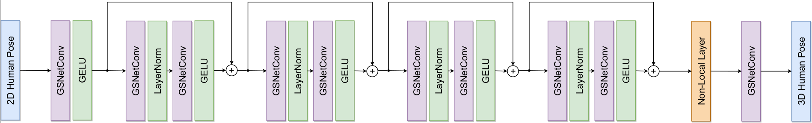

# Iterative Graph Filtering Network for 3D Human Pose Estimation
The source code will be released soon
## Network Architecture
<p align="center"></p>


## Qualitative Results
<p align="center"></p>


## Results on Human3.6M
Results under Protocol #1 (mean per-joint position error) and Protocol #2 (mean per-joint position error after rigid alignment).

| Method | MPJPE (P1) | PA-MPJPE (P2) |
|  :----:  | :----: | :----: |
| [SemGCN](https://github.com/garyzhao/SemGCN) | 57.6mm | - |
| [High-order GCN](https://github.com/ZhimingZo/HGCN) | 55.6mm | 43.7mm |
| [HOIF-Net](https://github.com/happyvictor008/Higher-Order-Implicit-Fairing-Networks-for-3D-Human-Pose-Estimation) | 54.8mm | 42.9mm |
| [Weight Unsharing](https://github.com/tamasino52/Any-GCN) | 52.4mm | 41.2mm |
| [MM-GCN](https://github.com/JaeYungLee/MM_GCN) | 51.7mm | 40.3mm |
| [Modulated GCN](https://github.com/ZhimingZo/Modulated-GCN) | 49.4mm | 39.1mm |
| Ours | **47.1mm** | **38.7mm** |

## Quick Start
This repository is built upon Python v3.8 and Pytorch v1.8.0 on Ubuntu 20.04.4 LTS. All experiments are conducted on a single NVIDIA RTX 3070 GPU with 8GB of memory.

## Dependencies
Please make sure you have the following dependencies installed:

* PyTorch >= 1.8.0
* NumPy
* Matplotlib

## Dataset
Our model is evaluated on [Human3.6M](http://vision.imar.ro/human3.6m) and [MPI-INF-3DHP](https://vcai.mpi-inf.mpg.de/3dhp-dataset/) datasets. Please put the datasets in `./dataset` directory.

### Human3.6M 
2D detections for Human3.6M dataset are provided by [VideoPose3D](https://github.com/facebookresearch/VideoPose3D) Pavllo et al.

### MPI-INF-3DHP
We set up the MPI-INF-3DHP dataset in the same way as [PoseAug](https://github.com/jfzhang95/PoseAug). Please refer to [DATASETS.md](https://github.com/jfzhang95/PoseAug/blob/main/DATASETS.md) for the preparation of the dataset file.


## Evaluating Our Pre-trained Models
The pre-trained models can be downloaded from [Google Drive](https://drive.google.com/drive/folders/1ByA9gmEEJSMJetQoIuRA2PYfQ7hVhJ3v?usp=sharing). Put them in the `./checkpoint` directory.

To evaluate our pre-trained model using the detected 2D keypoints, please run:
```bash
python main_graph.py -k hrn --post_refine --module_gcn_reload 1 --post_refine_reload 1 --save_out_type post --show_protocol2 --previous_dir './checkpoint/' --save_dir './checkpoint/test_result/' --module_gcn_model model_gsnet_3_eva_post_4710.pth --post_refine_model model_post_refine_3_eva_post_4710.pth --nepoch 2
```
